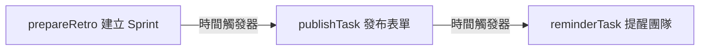
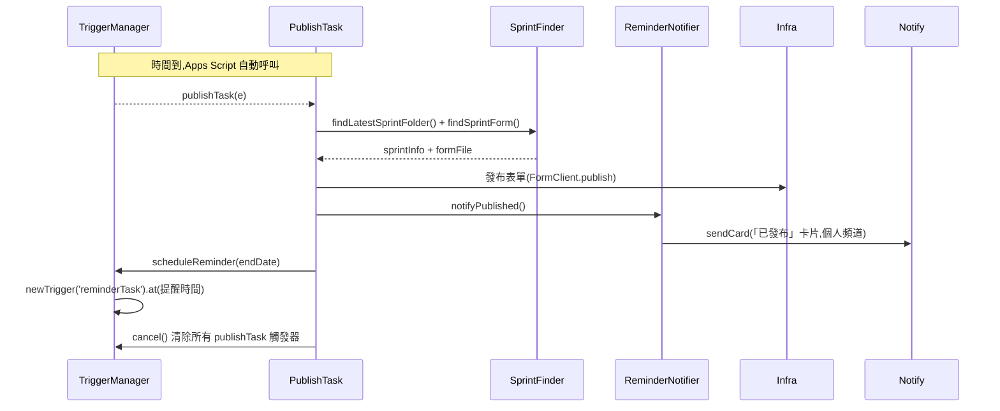
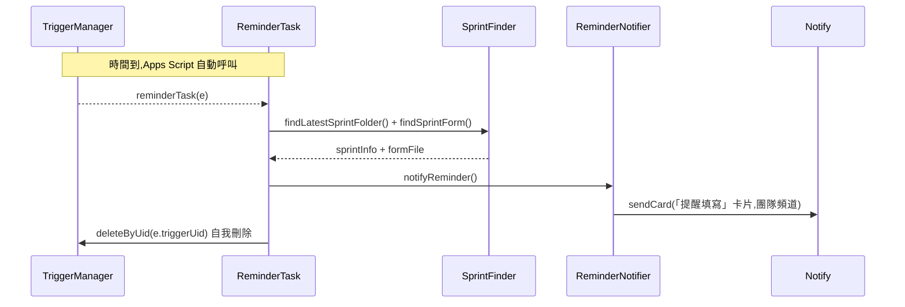

# retrospective

> 依賴 Library：**`Infra`**（v4）、**`Notify`**（v3）

Sprint 回顧自動化：建立 Sprint 資料夾/表單/投影片、定時發布問卷、定時提醒團隊填寫。

## 檔案

| 檔案 | 功能 |
|---|---|
| `prepareRetro.js` | 主入口，建立下一個 Sprint 並排定發布觸發器 |
| `RetroService.js` | Sprint 業務邏輯（建立資料夾/表單/投影片） |
| `PublishTask.js` | 觸發器：發布表單、排定提醒觸發器 |
| `ReminderTask.js` | 觸發器：提醒團隊填寫問卷 |
| `ReminderNotifier.js` | 組合訊息樣板 + Chat 發送 |
| `RetroMessageTemplate.js` | 三種通知的訊息格式 |
| `FailureNotifier.js` | 流程失敗時發錯誤通知到個人頻道 |
| `TriggerManager.js` | 時間觸發器建立/刪除/查詢 |
| `SprintFinder.js` | 共用的「找最新 Sprint 資料夾 / 找 Sprint 表單」邏輯 |
| `清除排程.js` | 維運工具：檢視與清除動態排程，讓流程 reset 重來 |

## 三張通知卡片

流程會發三張卡片，讀者與用途各不相同：

| | 卡片 1「已建立」 | 卡片 2「已發布」 | 卡片 3「提醒填寫」 |
|---|---|---|---|
| **發到** | 個人頻道 | 個人頻道 | 團隊頻道 |
| **讀者** | 主管 | 主管 | 團隊成員 |
| **回答的問題** | 東西建好了，在**哪裡**？ | 還剩多少時間可以調整？團隊會看到**什麼樣子**？ | 該**去填**了 |
| **標題** | ✅ Sprint XXX 已建立 | 🎉 Sprint XXX 問卷已發布 | 📋 Sprint XXX 回顧問卷填寫提醒 |
| **副標** | Sprint 起訖日 | 團隊將於 {時間} 收到填寫提醒 | 請記得填寫回顧問卷 |
| **欄位** | 📁 資料夾 · 📝 表單 · 📊 投影片 | 📝 表單 · ⏰ 團隊提醒時間 | 📝 填寫表單 |
| **按鈕** | 開啟資料夾 · 調整表單 | 預覽填寫畫面 · 調整表單 | 前往填寫 |
| **連結** | 編輯網址 | 預覽=填寫網址 調整=編輯網址 | 填寫網址 |

**卡片 2 是給主管確認用的，不是給填寫者。** 它發在 `publishTask`（結束日前 2 天 05:00）和 `reminderTask`（結束日前 1 天 10:00）之間，用意是讓表單建立者在團隊收到通知前，有約一天的時間確認內容、需要的話進去調整。所以副標寫的是「團隊什麼時候會收到通知」，而不是「請盡快完成」那種對填寫者說的話；按鈕也給兩個視角——先用「預覽填寫畫面」看團隊會看到的樣子，要改再點「調整表單」。

> 兩個網址不能混用：`formFile.getUrl()` 是**編輯**網址，`FormClient.getPublishedUrl()` 才是**填寫**網址。

## 出事的時候會怎樣

三個入口（`prepareRetro` / `publishTask` / `reminderTask`）發生例外時，除了寫執行記錄，還會**發一張錯誤卡片到個人 Chat 頻道**，內容包含：

- 哪一步失敗、失敗的函式名稱、錯誤訊息
- 逐步的處理指引（含「修好後要重跑哪一個函式」）
- 兩顆按鈕：**開啟 Apps Script 專案**、**開啟 scrum 資料夾**，不用自己找連結

`FailureNotifier` 刻意**不透過 `ReminderNotifier`**——後者的建構子要求兩個 webhook 都設定，萬一失敗原因正好是「webhook 沒設定」，拿它回報會再爆一次。它也全程包 try/catch，**自己絕不拋錯**，以免蓋掉原本要回報的錯誤。

### 失敗後怎麼恢復

流程失敗時，那次觸發過的排程會留下來（一次性排程執行完不會自動消失，而自我刪除是流程的最後一步）。這是**刻意的**：殘留排程會讓下一次 `prepareRetro` 被 `_assertNoPendingSprint()` 擋住，強迫人先把問題處理完，那次回顧才不會被跳過。

標準恢復流程：

1. 收到錯誤通知 → 依訊息修正原因（多半在 Drive 上，例如表單重複、資料夾缺漏）
2. 點通知上的按鈕進 Apps Script → 手動重跑失敗的那個函式（`publishTask()` 或 `reminderTask()`）
3. **手動重跑會順便把殘留排程清乾淨**，流程即恢復

`publishTask` 與 `ReminderTask` 都做了同樣處理：排程觸發時精確刪自己（`deleteByUid`），手動執行時因為沒有「自己」可刪，改為清除該類型所有待處理排程——因為手動執行等於已經代替那個排程把事情做完了。

## 維運工具：卡住時怎麼 reset

上面的恢復流程走不通時（例如根本不想補跑，只想整個重來），在 GAS 上方的「選擇要執行的函式」選這兩個：

| 函式 | 作用 |
|---|---|
| `listAllTriggers()` | 列出目前所有排程，標示哪些是動態排程（會被清除）、哪些是固定排程（保留）。**不會刪東西**，先看清楚用 |
| `clearDynamicTriggers()` | 清除所有動態排程，之後即可重新執行 `prepareRetro()` |

兩者都**只動排程、不動 Drive** —— 資料夾、表單、投影片都會保留。刪除 Drive 資料是不可逆操作，應由人確認後手動處理。

## 程序運作時序圖

整個流程分三段，中間靠 `TriggerManager` 建立的時間觸發器接力，不是函式直接呼叫：

### 階段一：建立 Sprint（`prepareRetro`）

`RetroService` 只有 `create()` 這個方法在這條鏈裡；`preview()`/`listAll()`/`validate()` 是手動診斷用的方法，不會被任何觸發器呼叫，圖裡沒畫出來。

### 階段二：發布表單（`publishTask`，由階段一排定的觸發器自動呼叫）

### 階段三：提醒團隊（`reminderTask`，由階段二排定的觸發器自動呼叫）

## 跨年 Sprint 的處理

Sprint 資料夾**依「開始日」的年份**歸檔，所以 `1228-0108`（2026/12/28 起、2027/01/08 迄）會放在 `2026/`，它的下一個 `0111-0122` 才回到 `2027/`。跨年只影響一個 Sprint，且它自始至終都是同一個資料夾、同一份表單。

搜尋端因此**不能假設「最新 Sprint 在今年的資料夾裡」**。`SprintFinder.js` 的做法是找「今年 + 去年」兩個年度資料夾，並且**以「Sprint 所在的年度資料夾年份」當基準年**解析日期——用今天的年份當基準會讓 `1228-0108` 在 2027 年被算成 2028/01/08，錯一整年。

為什麼是「今年 + 去年」而不是掃所有年度資料夾：Sprint 週期兩週，最新的一個只可能在這兩年裡。**兩年都找不到就該拋錯停下來**，因為 `_calcNextSprint()` 是從「上一個結束日」往後推算，硬撈出更舊的 Sprint 只會算出一個日期在過去的新 Sprint（還會拿過去的時間去排觸發器），把「該報錯的狀況」變成髒資料。

`RetroService._listAllSprints()` 共用同一個 `listRecentSprintFolders()`，兩邊不再各自實作。

## 為什麼不允許兩個 Sprint 並存

GAS 的一次性觸發器**無法夾帶參數**（不能寫成 `.at(date).withArgs('1228-0108')`），觸發時拿到的事件物件只有 `triggerUid`，沒有任何辦法知道「當初是為了哪個 Sprint 排的」。因此 `PublishTask` / `ReminderTask` 只能在觸發當下重新去 Drive 找「結束日最晚的 Sprint」。

這代表：只要系統裡同時存在兩個進行中的 Sprint，它們就會處理到錯的那一個——舊 Sprint 的表單沒發布、團隊沒收到提醒，新 Sprint 的表單反而提早兩週被發布。

解法不是讓程式有能力處理這種狀態（實務上沒有同時跑兩個 Sprint 回顧的需求），而是**讓它不可能發生**：

- `prepareRetro()` 在建立前呼叫 `_assertNoPendingSprint()`，只要還有待處理的動態排程（`publishTask` 或 `reminderTask`）就中止並報錯。排程觸發也一樣擋——正常情況這時不該有殘留排程，有的話代表上一輪出錯，停下來比繼續把狀況搞亂好。
- `PublishTask` 執行完改用 `deleteByUid(e.triggerUid)` **只刪自己**，不再用 `cancel()` 無差別刪掉所有 `publishTask` 觸發器（與 `ReminderTask` 的既有做法一致）。

動態排程與固定排程靠**函式名稱**分辨，名單在 `TriggerManager.DYNAMIC_HANDLERS`。觸發器物件查不到「一次性或週期性」，所以只能這樣判斷；你在 GAS 介面手動設定、每週執行 `prepareRetro` 的那個固定排程不在名單內，不會被碰到。

`TriggerManager.cancel()` 保留為手動工具（`cancelPublish()`），不再被自動流程呼叫。

## 已知限制（尚未修正）

### C 組：不會中斷流程的小問題

- `new RetroService()` 建構子會呼叫 `_resolveYearFolder()`，即使只是要跑 `validate()` 這類唯讀操作也會在 Drive 建立年度資料夾。
- `ReminderNotifier` 建構子要求 `RETRO_CHAT_WEBHOOK_URL` 和 `B_TEAM_RETRO_WEBHOOK` 兩個指令碼屬性都要設定，即使某些通知方法只會用到其中一個。
- `PublishTask.js`、`prepareRetro.js`、`RetroService.js` 各自有一份邏輯相同的 `_formatDate()`，尚未合併成共用函式。

### D 組：失敗後的復原

- **`prepareRetro` 部分失敗會留下不一致狀態**：順序是 `create()` → `notifyCreated()` → `schedulePublish()`。若在第 2 步失敗（例如 webhook 指令碼屬性未設定，`ReminderNotifier` 建構子直接拋錯），資料夾／表單／投影片都已建立，但**發布觸發器沒排定**。現在會收到錯誤通知，但下週 `_shouldRunToday()` 仍會判定「還沒到下一個 Sprint」而跳過，該 Sprint 不會自動補救。
- **重跑會被擋住**：`DriveClient.createFolder()` 預設 `allowDuplicate = false`，同名資料夾已存在就拋錯，所以手動重跑 `prepareRetro()` 無法補救上一項，必須先手動刪掉 Drive 上的資料夾。可能的修法是讓建立變成可重複執行（資料夾已存在就沿用、表單投影片檢查存在才複製）。
- **通知發送失敗會被吞掉**：`Notifier._post()` 內部 catch 住 HTTP 錯誤並回傳 `false`，只寫 log 不拋錯。所以 webhook 失效時流程照常走完，但沒有人收到任何通知，也不會有錯誤。

### R 組：其他待處理

- **`_calcNextSprint()` 沒檢查算出的日期是否在未來**。若 `prepareRetro` 停擺數週後才恢復，會建立一個起訖日都在過去的 Sprint，`schedulePublish()` 也會拿過去的時間去排排程。（Apps Script 對過去時間的 `.at()` 是接受並儘快執行而非拒絕——此為文件推論，未實測。）
- **`testScheduledRun()` / `testReminderNotifier()` 名為測試，實際是完整正式執行**：會建立真的 Drive 資料夾、複製範本、發真的 Chat 卡片、裝真的排程。它們在 GAS 的函式下拉選單裡跟 `clearDynamicTriggers()` 等維運函式並列，reset 時手滑選錯會多建一個 Sprint。
