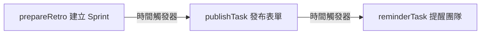
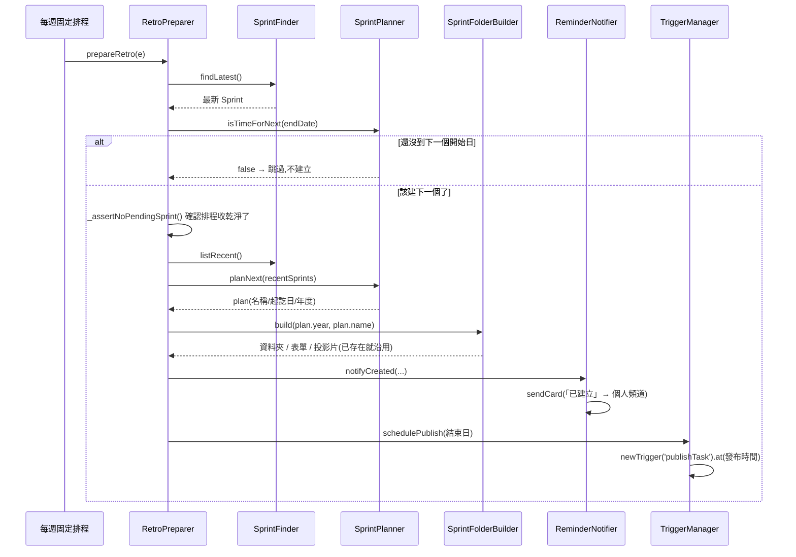
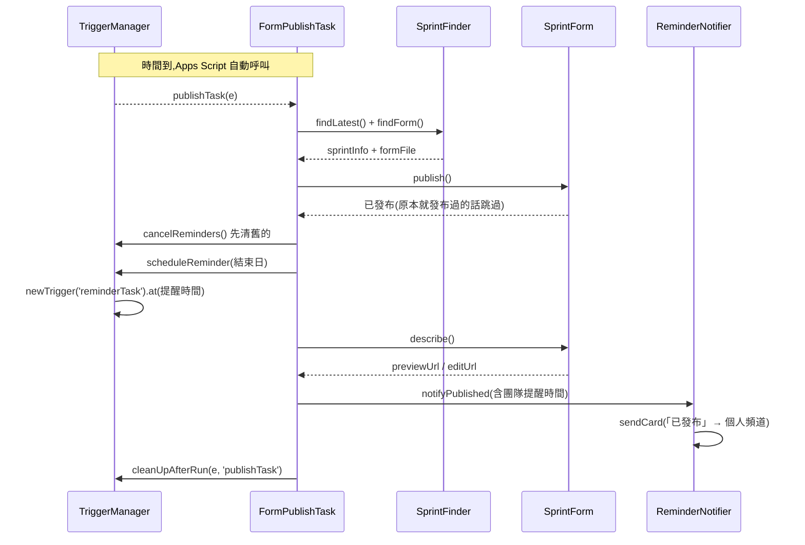
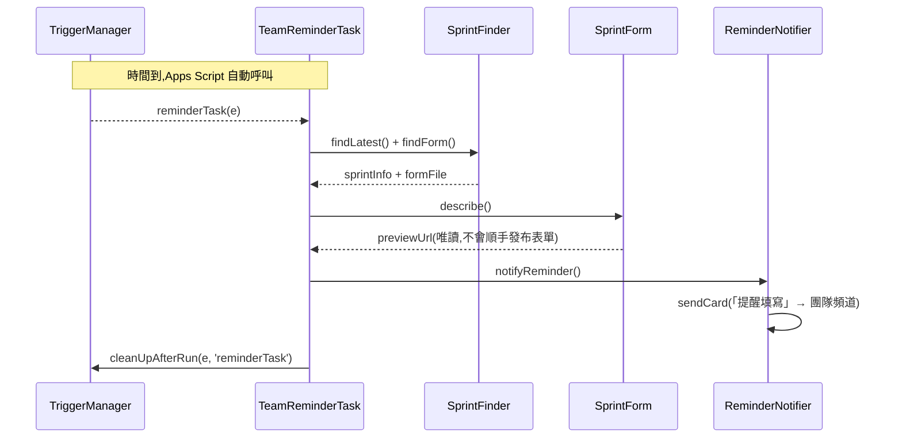

# retrospective

> 依賴 Library：**`Infra`**（v4）、**`Notify`**（v3）

Sprint 回顧自動化：建立 Sprint 資料夾/表單/投影片、定時發布問卷、定時提醒團隊填寫。

## 架構

分成三層。**動作層每個類別單一職責、都能單獨呼叫**；編排層只負責串接，自己不含業務邏輯。

```
排程入口(全域函式,GAS 觸發器只認這個)
├── prepareRetro   → RetroPreparer      建立下一個 Sprint
├── publishTask    → FormPublishTask    發布表單
└── reminderTask   → TeamReminderTask   提醒團隊
                            ↓ 組裝並呼叫
動作層(每個都能單獨用,見「手動操作」)
├── SprintFinder          在 Drive 上定位 Sprint 資料夾與表單
├── SprintPlanner         推算下一個 Sprint 是什麼(純計算,不碰 Drive)
├── SprintFolderBuilder   建資料夾 + 複製樣板
├── SprintForm            發布表單 / 讀取兩種網址
├── TriggerManager        排程的算/建/查/刪
├── TriggerInspector      排程的檢視與清除
├── ReminderNotifier      三種通知的發送
├── RetroMessageTemplate  三種通知的訊息格式
├── FailureNotifier       失敗時的錯誤通知
└── DateFormat            日期格式化
```

| 檔案 | Class | 職責 |
|---|---|---|
| `prepareRetro.js` | `RetroPreparer` | 編排：算 → 建 → 通知 → 排程。也是**組裝根**，設定 `SPRINT_OPTIONS` 在這裡 |
| `PublishTask.js` | `FormPublishTask` | 編排：發布 → 排提醒 → 通知 → 清排程 |
| `ReminderTask.js` | `TeamReminderTask` | 編排：讀網址 → 通知團隊 → 清排程 |
| `SprintFinder.js` | `SprintFinder` | 定位 Sprint 資料夾與表單（只讀不寫） |
| `SprintPlanner.js` | `SprintPlanner` | 推算下一個 Sprint（純計算，完全不碰 Drive） |
| `SprintFolderBuilder.js` | `SprintFolderBuilder` | 建資料夾與複製檔案（已存在就沿用/跳過） |
| `SprintForm.js` | `SprintForm` | 某個 Sprint 的表單：發布、讀取網址 |
| `TriggerManager.js` | `TriggerManager` | 排程的算/建/查/刪 |
| `TriggerInspector.js` | `TriggerInspector` | 排程的檢視與清除 |
| `ReminderNotifier.js` | `ReminderNotifier` | 三種通知發到對的頻道 |
| `RetroMessageTemplate.js` | `RetroMessageTemplate` | 三種通知的訊息格式 |
| `FailureNotifier.js` | `FailureNotifier` | 失敗時的錯誤通知（絕不拋錯） |
| `DateFormat.js` | `DateFormat` | 日期格式化（靜態方法） |
| `手動操作.js` | —（純入口） | 每個動作的手動執行函式 |

### 幾個刻意的設計

**依賴由建構子注入。** 底層類別不呼叫 `Infra.createDriveClient()`，一律由編排層（組裝根）建立後傳進去。所以 `SprintPlanner` 可以完全不依賴任何 Google 服務就跑單元測試。

**入口一定是全域函式。** GAS 的觸發器只能綁全域函式名稱，「選擇要執行的函式」選單也只列全域函式。所以 `prepareRetro`／`publishTask`／`reminderTask` 與所有手動操作都是全域函式，但它們都只是一行薄包裝，邏輯在類別裡。

**命名規範**：class 是名詞、方法是動詞、私有一律加 `_`。這些規則有測試自動把關。

## 三張通知卡片

流程會發三張卡片，讀者與用途各不相同：

| | 卡片 1「已建立」 | 卡片 2「已發布」 | 卡片 3「提醒填寫」 |
|---|---|---|---|
| **發到** | 個人頻道 | 個人頻道 | 團隊頻道 |
| **讀者** | 主管 | 主管 | 團隊成員 |
| **回答的問題** | 東西建好了，在**哪裡**？ | 還剩多少時間可以調整？團隊會看到**什麼樣子**？ | 該**去填**了 |
| **標題** | ✅ Sprint XXX 已建立 | 🎉 Sprint XXX 問卷已發布 | 📋 Sprint XXX 回顧問卷填寫提醒 |
| **副標** | Sprint 起訖日 | 團隊將於 {時間} 收到填寫提醒 | 請記得填寫回顧問卷 |
| **欄位** | 📁 資料夾 · 📝 表單 · 📊 投影片 | 📝 表單 · ⏰ 團隊提醒時間 | 📝 填寫表單 |
| **按鈕** | 開啟資料夾 · 調整表單 | 預覽填寫畫面 · 調整表單 | 前往填寫 |
| **連結** | 編輯網址 | 預覽=填寫網址<br>調整=編輯網址 | 填寫網址 |

**卡片 2 是給主管確認用的，不是給填寫者。** 它發在 `publishTask`（結束日前 2 天 05:00）和 `reminderTask`（結束日前 1 天 10:00）之間，用意是讓表單建立者在團隊收到通知前，有約一天的時間確認內容、需要的話進去調整。所以副標寫的是「團隊什麼時候會收到通知」，而不是「請盡快完成」那種對填寫者說的話；按鈕也給兩個視角——先用「預覽填寫畫面」看團隊會看到的樣子，要改再點「調整表單」。

> 兩個網址不能混用：`formFile.getUrl()` 是**編輯**網址，`FormClient.getPublishedUrl()` 才是**填寫**網址。

## 出事的時候會怎樣

三個入口（`prepareRetro` / `publishTask` / `reminderTask`）發生例外時，除了寫執行記錄，還會**發一張錯誤卡片到個人 Chat 頻道**，內容包含：

- 哪一步失敗、失敗的函式名稱、錯誤訊息
- 逐步的處理指引（含「修好後要重跑哪一個函式」）
- 兩顆按鈕：**開啟 Apps Script 專案**、**開啟 scrum 資料夾**，不用自己找連結

`FailureNotifier` 刻意**不透過 `ReminderNotifier`**——後者的建構子要求兩個 webhook 都設定，萬一失敗原因正好是「webhook 沒設定」，拿它回報會再爆一次。它也全程包 try/catch，**自己絕不拋錯**，以免蓋掉原本要回報的錯誤。

### 失敗後怎麼恢復：不做自動修復，你自己補呼叫

**程式不會嘗試自動補救。** 失敗就通知你，你看通知判斷缺了哪一步，就執行對應的函式補上。這樣狀況比較好掌握，也不會有「它幫我修了什麼我不知道」的問題。

所以流程的每一步都拆成可以單獨執行的函式：

| 步驟 | 手動函式 |
|---|---|
| 建資料夾 + 複製表單/投影片 | `createSprintFolder()` |
| 把表單設為已發布 | `publishLatestForm()` |
| 排定表單發布的時間 | `schedulePublishTask()` |
| 排定團隊提醒的時間 | `scheduleReminderTask()` |
| 補發「已建立」卡片（個人） | `notifyOwnerCreated()` |
| 補發「已發布」卡片（個人） | `notifyOwnerPublished()` |
| 補發填寫提醒（團隊） | `notifyTeamReminder()` |

標準流程：

1. 收到錯誤通知 → 依訊息修正原因（多半在 Drive 上，例如表單重複、資料夾缺漏）
2. 點通知上的按鈕進 Apps Script，先執行 **`showRetroStatus()`** 看現在缺什麼
3. 執行上表對應的函式補上

`createSprintFolder()` 是**可重複執行**的——資料夾、表單、投影片都是「已存在就沿用/跳過」，所以上次建到一半失敗，再跑一次就會把缺的補齊，不用去 Drive 手動刪。

### 為什麼殘留排程會擋住 `prepareRetro`

一次性排程執行完不會自動消失，而自我刪除是流程的最後一步。所以流程中途失敗時，那個已經觸發過的排程會留下來，讓下一次 `prepareRetro` 被 `_assertNoPendingSprint()` 擋住。

這是**刻意的**：它強迫人先把問題處理完，那次回顧才不會被悄悄跳過。

`FormPublishTask` 與 `TeamReminderTask` 都用 `TriggerManager.cleanUpAfterRun()` 收尾——排程觸發時精確刪自己（`deleteByUid`），手動執行時因為沒有「自己」可刪，改為清除該類型所有待處理排程（手動執行等於已經代替那個排程把事情做完了）。

## 手動操作與維運

在 GAS 上方「選擇要執行的函式」選單執行。

| 函式 | 作用 |
|---|---|
| `showRetroStatus()` | **出事時第一個跑**——最新 Sprint、表單發布狀態、待處理排程、該不該建下一個 |
| `showNextSprint()` | 預覽下一個 Sprint 會是什麼，不建立 |
| `showRecentSprints()` | 列出今年與去年的 Sprint |
| `checkRetroSetup()` | 檢查根資料夾與樣板設定（唯讀） |
| `listAllTriggers()` | 列出所有排程，標示動態（會被清除）／固定（保留）。**不會刪東西** |
| `clearDynamicTriggers()` | 清除所有動態排程，之後即可重新執行 `prepareRetro()` |

排程維運**只動排程、不動 Drive**——資料夾、表單、投影片都會保留。刪除 Drive 資料是不可逆操作，應由人確認後手動處理。

### 手動建立指定的 Sprint

`createSprintFolder()` 預設會自動接續最新 Sprint 往後推算。想指定的話改 `手動操作.gs` 最上面的常數：

```js
const MANUAL_SPRINT = { year: 2026, start: '0622', end: '0703' };
```

GAS 的函式選單無法傳參數，所以只能用常數指定——這跟 `jira/quarterly-tickets` 的 `SPECIFIC_QUARTER` 是同一個做法。

完全沒有任何 Sprint 資料夾時（第一次啟用），它會從**本週一**推算第一個並在 log 警示。

## 程序運作時序圖

整個流程分三段，中間靠 `TriggerManager` 建立的時間觸發器接力，不是函式直接呼叫：



### 階段一：建立 Sprint（`prepareRetro`）



`SprintPlanner` 拿到的是 `SprintFinder` 撈好的清單，它自己完全不碰 Drive——所以日期推算的邏輯可以完整單元測試。

### 階段二：發布表單（`publishTask`，由階段一排定的觸發器自動呼叫）



通知排在「排定提醒」之後才發，因為卡片上要顯示團隊什麼時候會收到提醒。

### 階段三：提醒團隊（`reminderTask`，由階段二排定的觸發器自動呼叫）



## 跨年 Sprint 的處理

Sprint 資料夾**依「開始日」的年份**歸檔，所以 `1228-0108`（2026/12/28 起、2027/01/08 迄）會放在 `2026/`，它的下一個 `0111-0122` 才回到 `2027/`。跨年只影響一個 Sprint，且它自始至終都是同一個資料夾、同一份表單。

搜尋端因此**不能假設「最新 Sprint 在今年的資料夾裡」**。`SprintFinder.js` 的做法是找「今年 + 去年」兩個年度資料夾，並且**以「Sprint 所在的年度資料夾年份」當基準年**解析日期——用今天的年份當基準會讓 `1228-0108` 在 2027 年被算成 2028/01/08，錯一整年。

為什麼是「今年 + 去年」而不是掃所有年度資料夾：Sprint 週期兩週，最新的一個只可能在這兩年裡。**兩年都找不到就該拋錯停下來**，因為 `SprintPlanner.planNext()` 是從「上一個結束日」往後推算，硬撈出更舊的 Sprint 只會算出一個日期在過去的新 Sprint（還會拿過去的時間去排排程），把「該報錯的狀況」變成髒資料。

## 為什麼不允許兩個 Sprint 並存

GAS 的一次性觸發器**無法夾帶參數**（不能寫成 `.at(date).withArgs('1228-0108')`），觸發時拿到的事件物件只有 `triggerUid`，沒有任何辦法知道「當初是為了哪個 Sprint 排的」。因此 `PublishTask` / `ReminderTask` 只能在觸發當下重新去 Drive 找「結束日最晚的 Sprint」。

這代表：只要系統裡同時存在兩個進行中的 Sprint，它們就會處理到錯的那一個——舊 Sprint 的表單沒發布、團隊沒收到提醒，新 Sprint 的表單反而提早兩週被發布。

解法不是讓程式有能力處理這種狀態（實務上沒有同時跑兩個 Sprint 回顧的需求），而是**讓它不可能發生**：

- `RetroPreparer` 在建立前呼叫 `_assertNoPendingSprint()`，只要還有待處理的動態排程（`publishTask` 或 `reminderTask`）就中止並報錯。
- `FormPublishTask` 與 `TeamReminderTask` 都用 `TriggerManager.cleanUpAfterRun()` 收尾——排程觸發時精確刪自己，手動執行時清除該類型所有待處理排程。

動態排程與固定排程靠**函式名稱**分辨，名單在 `TriggerManager.DYNAMIC_HANDLERS`。排程物件查不到「一次性或週期性」，所以只能這樣判斷；你在 GAS 介面手動設定、每週執行 `prepareRetro` 的那個固定排程不在名單內，不會被碰到。

## 已知限制（尚未修正）

- **`SprintPlanner.planNext()` 沒檢查算出的日期是否在未來**。若 `prepareRetro` 停擺數週後才恢復，會建立一個起訖日都在過去的 Sprint，`schedulePublish()` 也會拿過去的時間去排排程。（Apps Script 對過去時間的 `.at()` 是接受並儘快執行而非拒絕——此為文件推論，未實測。）手動操作的 `schedulePublishTask()` / `scheduleReminderTask()` 已經會在這種情況警示，但自動流程還沒防。
- **`ReminderNotifier` 建構子要求兩個 webhook 都設定**（`RETRO_CHAT_WEBHOOK_URL` 和 `B_TEAM_RETRO_WEBHOOK`），即使某些通知方法只會用到其中一個。只設定個人頻道就完全不能發任何通知。
- **通知發送失敗會被吞掉**：`Notifier._post()` 內部 catch 住 HTTP 錯誤並回傳 `false`，只寫 log 不拋錯。所以 webhook 失效時流程照常走完，但沒有人收到任何通知，也不會有錯誤。
