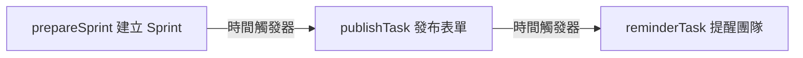
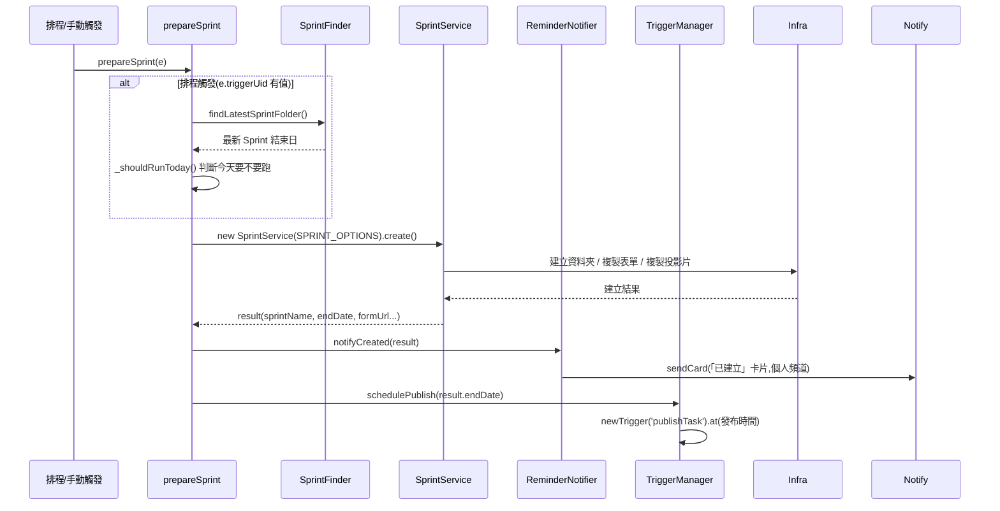
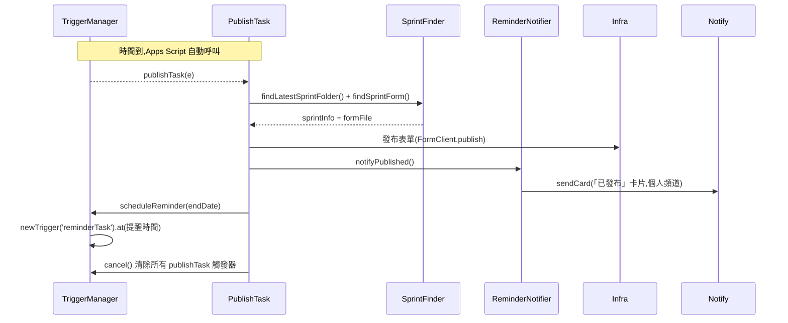
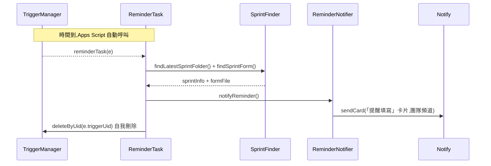

# retrospective

> 依賴 Library：**`Infra`**（v4）、**`Notify`**（v3）

Sprint 回顧自動化：建立 Sprint 資料夾/表單/投影片、定時發布問卷、定時提醒團隊填寫。

## 檔案

| 檔案 | 功能 |
|---|---|
| `prepareSprint.js` | 主入口，建立下一個 Sprint 並排定發布觸發器 |
| `SprintService.js` | Sprint 業務邏輯（建立資料夾/表單/投影片） |
| `PublishTask.js` | 觸發器：發布表單、排定提醒觸發器 |
| `ReminderTask.js` | 觸發器：提醒團隊填寫問卷 |
| `ReminderNotifier.js` | 組合訊息樣板 + Chat 發送 |
| `MessageTemplate.js` | 三種通知的訊息格式 |
| `TriggerManager.js` | 時間觸發器建立/刪除/查詢 |
| `SprintFinder.js` | 共用的「找最新 Sprint 資料夾 / 找 Sprint 表單」邏輯 |

## 程序運作時序圖

整個流程分三段，中間靠 `TriggerManager` 建立的時間觸發器接力，不是函式直接呼叫：

### 階段一：建立 Sprint（`prepareSprint`）

`SprintService` 只有 `create()` 這個方法在這條鏈裡；`preview()`/`listAll()`/`validate()` 是手動診斷用的方法，不會被任何觸發器呼叫，圖裡沒畫出來。

### 階段二：發布表單（`publishTask`，由階段一排定的觸發器自動呼叫）

### 階段三：提醒團隊（`reminderTask`，由階段二排定的觸發器自動呼叫）

## 跨年 Sprint 的處理

Sprint 資料夾**依「開始日」的年份**歸檔，所以 `1228-0108`（2026/12/28 起、2027/01/08 迄）會放在 `2026/`，它的下一個 `0111-0122` 才回到 `2027/`。跨年只影響一個 Sprint，且它自始至終都是同一個資料夾、同一份表單。

搜尋端因此**不能假設「最新 Sprint 在今年的資料夾裡」**。`SprintFinder.js` 的做法是找「今年 + 去年」兩個年度資料夾，並且**以「Sprint 所在的年度資料夾年份」當基準年**解析日期——用今天的年份當基準會讓 `1228-0108` 在 2027 年被算成 2028/01/08，錯一整年。

為什麼是「今年 + 去年」而不是掃所有年度資料夾：Sprint 週期兩週，最新的一個只可能在這兩年裡。**兩年都找不到就該拋錯停下來**，因為 `_calcNextSprint()` 是從「上一個結束日」往後推算，硬撈出更舊的 Sprint 只會算出一個日期在過去的新 Sprint（還會拿過去的時間去排觸發器），把「該報錯的狀況」變成髒資料。

`SprintService._listAllSprints()` 共用同一個 `listRecentSprintFolders()`，兩邊不再各自實作。

## 已知限制（尚未修正）

### B 組：觸發器沒有攜帶 Sprint 身份

根因相同——GAS 的一次性觸發器無法夾帶參數，所以觸發時只能「重新推導最新 Sprint」。

- `TriggerManager.cancel()` 會刪掉**所有** `publishTask` 觸發器而不分屬於哪個 Sprint。若手動提前建立下一個 Sprint，舊 Sprint 的 publishTask 觸發時會把新 Sprint 尚未到期的觸發器一併刪除，導致新表單永遠不會發布。
- `PublishTask` / `ReminderTask` 觸發時重新推導最新 Sprint，而非沿用排定當下的那個。若期間手動建立了新 Sprint，通知會指向錯誤的 Sprint（團隊會收到還沒發布的表單連結）。

### C 組：不會中斷流程的小問題

- `PublishTask.notifyPublished()` 傳的是表單編輯網址，不是填寫網址，跟 `ReminderTask` 用 `getPublishedUrl()` 的做法不一致。
- `new SprintService()` 建構子會呼叫 `_resolveYearFolder()`，即使只是要跑 `validate()` 這類唯讀操作也會在 Drive 建立年度資料夾。
- `ReminderNotifier` 建構子要求 `RETRO_CHAT_WEBHOOK_URL` 和 `B_TEAM_RETRO_WEBHOOK` 兩個指令碼屬性都要設定，即使某些通知方法只會用到其中一個。
- `PublishTask.js`、`prepareSprint.js`、`SprintService.js` 各自有一份邏輯相同的 `_formatDate()`，尚未合併成共用函式。

### D 組：失敗時沒有通知，且無法自動復原

三個入口（`prepareSprint` / `publishTask` / `reminderTask`）的 catch 都只做 `Logger.log` + rethrow，`ReminderNotifier` 也沒有對應的錯誤通知方法。失敗時只能靠「手動去看執行記錄」或「Apps Script 內建寄給指令碼擁有者的觸發器失敗 email」得知，團隊頻道完全不會知道。

- **部分失敗會留下不一致狀態**：`prepareSprint` 的順序是 `create()` → `notifyCreated()` → `schedulePublish()`。若在第 2 步失敗（例如 webhook 指令碼屬性未設定，`ReminderNotifier` 建構子直接拋錯），資料夾／表單／投影片都已建立，但**發布觸發器沒排定**。下週 `_shouldRunToday()` 會判定「還沒到下一個 Sprint」而跳過，於是該 Sprint 靜默停擺，不再產生任何錯誤訊息。
- **重跑會被擋住**：`DriveClient.createFolder()` 預設 `allowDuplicate = false`，同名資料夾已存在就拋錯，所以手動重跑 `prepareSprint()` 無法補救，必須先手動刪掉 Drive 上的資料夾。
- **通知發送失敗會被吞掉**：`Notifier._post()` 內部 catch 住 HTTP 錯誤並回傳 `false`，只寫 log 不拋錯。所以 webhook 失效時流程照常走完，但沒有人收到任何通知，也不會有錯誤。

可能的修法方向：在 `ReminderNotifier` 加 `notifyError(step, error)` 發到個人頻道，並把三個入口的 catch 改成先發通知再 rethrow（需注意通知失敗時不要再引發新的例外）。
